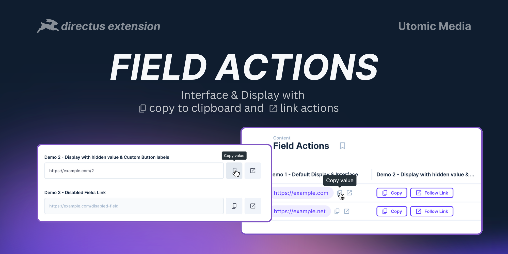
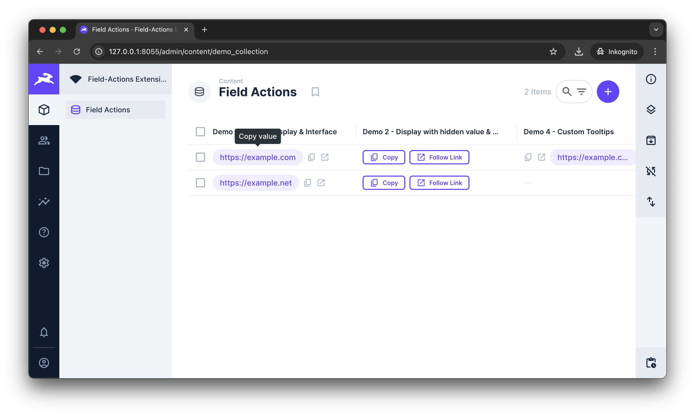
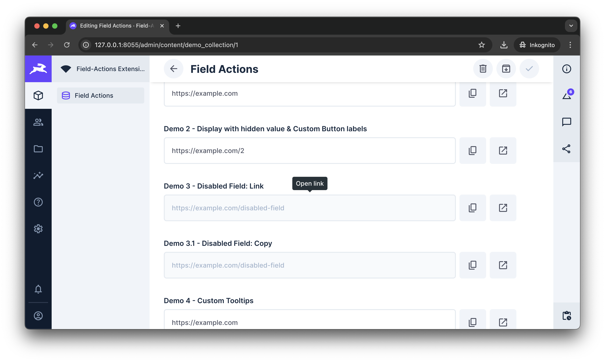
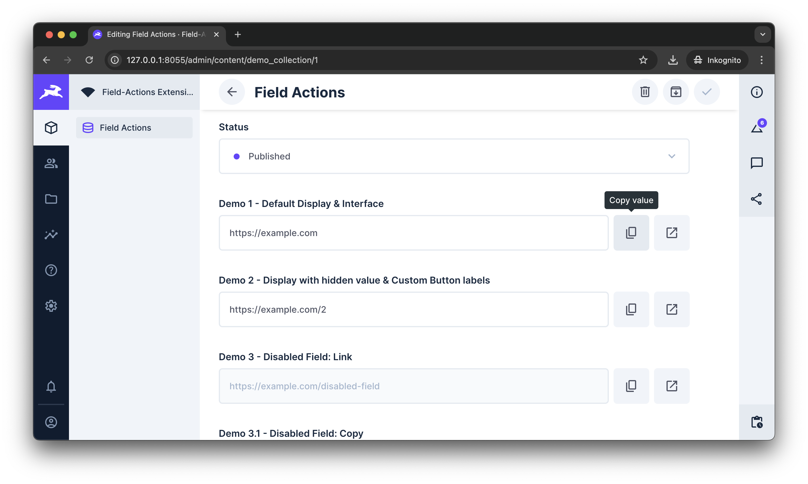
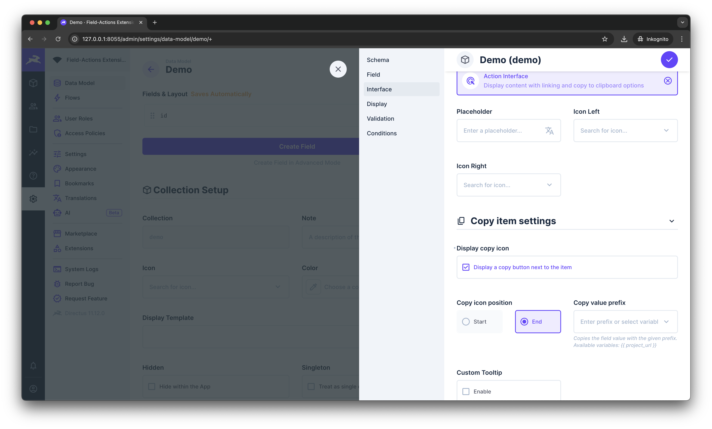
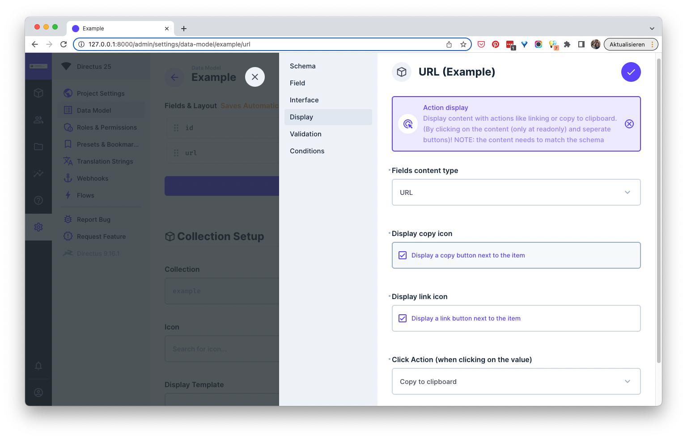

# 🐰 Directus extension: Text action display & interface
> 💡 A directus interface + display adding `copy to clipboard` and `link` actions to your values.
> 
> The actions can be performed by a button next to the items or by clicking on the value.

<br />


*↑ Add copy-to-clipboard and link functions to your data*

<br />

## ✨ Supports
### 📋 Copy action
Each value can be copied by a custom button. If enabled it's also possible to copy a value by just clickung on it (click-action)

### ➡️ Links
When using the link-option it supports ➡️ HTTP-, 📧 mail-, and 📞 phone- links. Each link can be opened by the custom button. If enabled it's also possible to open the link by just clicking on the value (click-action).

*Note: The extensions currently won't parse invalid links into valid ones!*

### 🖱 Click-Action
Displays and disabled interfaces (== readonly) support a custom click-action. This can be one of:
* default action (does nothing custom)
* Copy-action (copied the value)
* Link-action (openes the link in a new tab)

### ⚙ Settings
#### Icon position
- The icons can be placed before or after the content
- The setting can be set for the interface and display, as well as the copy and link button indipendently
- Example in the screenshots below

#### Custom prefix
- You can set custom prefixes for copy-/ and link-actions.
- Prefixes can be entered manually or use a defined variable ([Project URL setting](https://docs.directus.io/configuration/project-settings.html#general))
- The setting can be set for the interface and display, as well as the copy and link button indipendently
- Example in the screenshots below

<br />

## ⚙️ Installation (npm)
```
npm i directus-extension-field-actions
```

or

```
pnpm i directus-extension-field-actions
```

## ⚙️ Installation (manually)
>
> **NOTE:** With version 1.3 we switched to a directus extension bundle. This way the display and interface are included in one extension.
> 
> Unfortunately this is only supported for installations via npm. We're looking for a solution to support an installation via local files again.
>
~~1. Download the `app.js` and `api.js` from the [latest release](https://github.com/utomic-media/directus-extension-field-actions/releases)~~

~~2. Create a folder named `field-actions` in your displays- as well as interfaces-extension folder (e.g  `/extensions/displays/field-actions` and `/extensions/interfaces/field-actions`)~~

~~3. Move the downloaded release files each to the folder and rename each of them into `index.js`~~

~~4. Restart directus~~

<br />

## 🖼 Screenshots

*↑ Copy values from table views directly by clicking on them or an icon (configurable)*

---


*↑ Copy field-values by clicking on it (only for readonly-fields and displays)*

---


*↑ Add link- and copy-to-clipboard buttons to each field*

---


*↑ Interfaces settings*

---


*↑ Displays settings*

---

