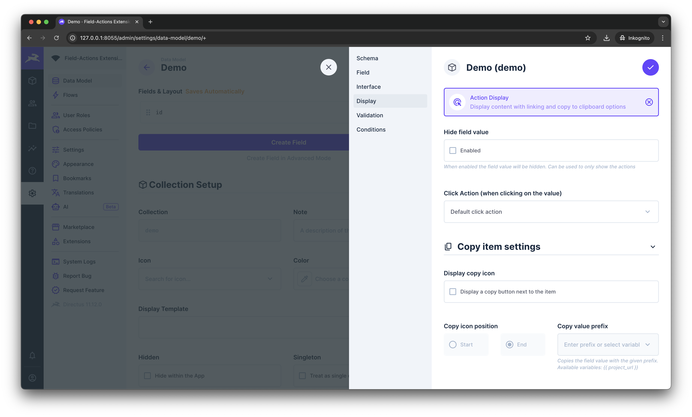

# Directus extension: Text action display & interface
> 💡 A directus interface + display adding `copy to clipboard` and `link` actions to your values.
> 
> The actions can be performed by a button next to the items or by clicking on the value.

*Add copy-to-clipboard and link functions to your data*

## Supports
When using the link-option it supports HTTP-, mail-, ans phone- links. Copy actions are supported for all values.

*Note: For links your value must match the selected format. The extensions currently won't parse invalid links into valid ones!*

# Install
1. Download the `display-index.js` and `interface-index.js` from the [latest release](https://github.com/utomic-media/directus-extension-field-actions/releases)
2. Create a folder named `field-actions` in your displays- as well as interfaces-extension folder (e.g  `/extensions/displays/fields-action` and `/extensions/interfaces/fields-action`)
3. Move the downloaded release files each to the folder and rename each of them into `index.js`
4. Restart directus

# Screenshots

*Copy values from table views directly by clicking on them or an icon (configurable)*

*Copy field-values by clicking on it (only for readonly-fields and displays)*

*Add link- and copy-to-clipboard buttons to each field*

*Interfaces settings*

*Displays settings*

